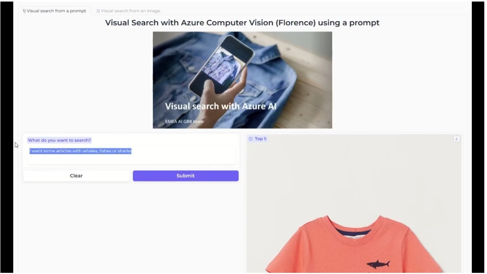

# Visual search with Azure Computer Vision and Azure Cognitive Search

We will use vectors embeddings generation using **Azure Computer Vision 4** and **Azure Cognitive Search** and its new vectors support capabilities to build a visual search application.

## Visual search with vector embeddings
**Vector embeddings** are a way of representing content such as text or images as vectors of real numbers in a high-dimensional space. These embeddings are often learned from large amounts of textual and visual data using machine learning algorithms like neural networks. Each dimension of the vector corresponds to a different feature or attribute of the content, such as its semantic meaning, syntactic role, or context in which it commonly appears. By representing content as vectors, we can perform mathematical operations on them to compare their similarity or use them as inputs to machine learning models.

**Azure Cognitive Search** today doesn't provide a way to vectorize documents and queries, leaving it up to you to pick the best embedding model for your data. 
In this example we will use **Azure Computer Vision** to generate the embeddings.

## Notebooks

- Introduction to vectors embeddings with Azure Computer Vision 4: 
<a href="1. Vectors embeddings with Azure Computer Vision.ipynb">1. Vectors embeddings with Azure Computer Vision</a>
- Creation of a fashion visual search demo using Azure Computer Vision and Azure Cognitive search: 
<a href="2. Visual search - Azure Cognitive Search index creation.ipynb">2. Visual search - Azure Cognitive Search index creation</a>
- Some visual search examples: 
<a href="3. Visual search - examples.ipynb">3. Visual search - examples</a>
- A gradio webapp for the search: 
<a href="4. Visual search - webapp.ipynb">4. Visual search - webapp</a>
- UMAP analysis on the vectors embeddings: 
<a href="5. Visual Search - UMAP.ipynb">5. Visual Search - UMAP</a>
- Visual search with Azure Open AI, Azure Speech Services and Azure Cognitive Search: 
<a href="6. Visual search - Azure Open AI.ipynb">6. Visual search - Azure Open AI</a>

Note: You need to write your Azure AI credentials in the **azure.env** file: <a href="azure.env">azure.env</a>

## Demo video
<a href="https://www.youtube.com/watch?v=uHQFTUjQWp4">YouTube demo video</a>

## Some examples of a prompt search

## Some examples of an image search

## Steps
1. Connect to a blob storage where your catalog images are
2. Use Azure Computer Vision 4 to embed all these images
3. Create an Azure Cognitive search vector store index
4. Upload the embeddings into an Azure Cognitive Search index
5. Do some visual search using a prompt or an image

## Business applications
- Digital asset management: Image retrieval can be used to manage large collections of digital images, such as in museums, archives, or online galleries. Users can search for images based on visual features and retrieve the images that match their criteria.
- Medical image retrieval: Image retrieval can be used in medical imaging to search for images based on their diagnostic features or disease patterns. This can help doctors or researchers to identify similar cases or track disease progression.
- Security and surveillance: Image retrieval can be used in security and surveillance systems to search for images based on specific features or patterns, such as in, people & object tracking, or threat detection.
- Forensic image retrieval: Image retrieval can be used in forensic investigations to search for images based on their visual content or metadata, such as in cases of cyber-crime.
- E-commerce: Image retrieval can be used in online shopping applications to search for similar products based on their features or descriptions or provide recommendations based on previous purchases.
- Fashion and design: Image retrieval can be used in fashion and design to search for images based on their visual features, such as color, pattern, or texture. This can help designers or retailers to identify similar products or trends.

## To learn more
- https://learn.microsoft.com/en-us/azure/cognitive-services/computer-vision/concept-image-retrieval
- https://learn.microsoft.com/en-us/azure/search/search-what-is-azure-search
- https://techcommunity.microsoft.com/t5/azure-ai-services-blog/announcing-vector-search-in-azure-cognitive-search-public/ba-p/3872868

## Fashion images
We used some samples fashion images that are available here:
https://www.kaggle.com/datasets/paramaggarwal/fashion-product-images-dataset

 
 
22-June-2023 
Updated 30-June-2023 
 
Serge Retkowsky | serge.retkowsky@microsoft.com | https://www.linkedin.com/in/serger/
